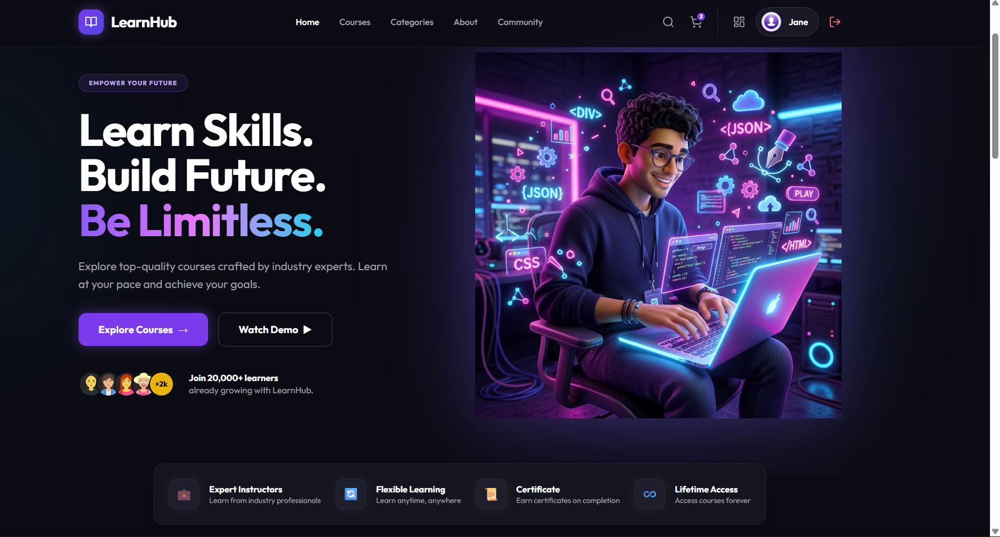
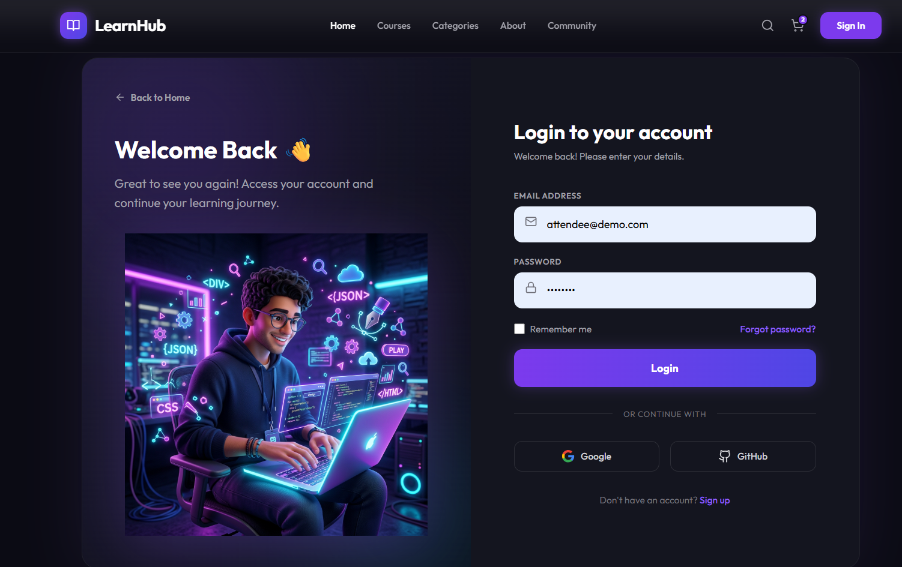
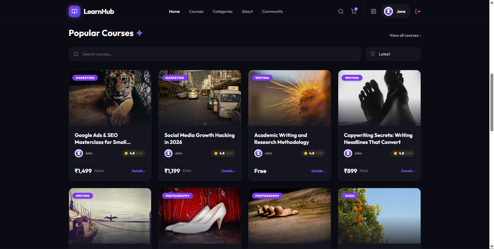
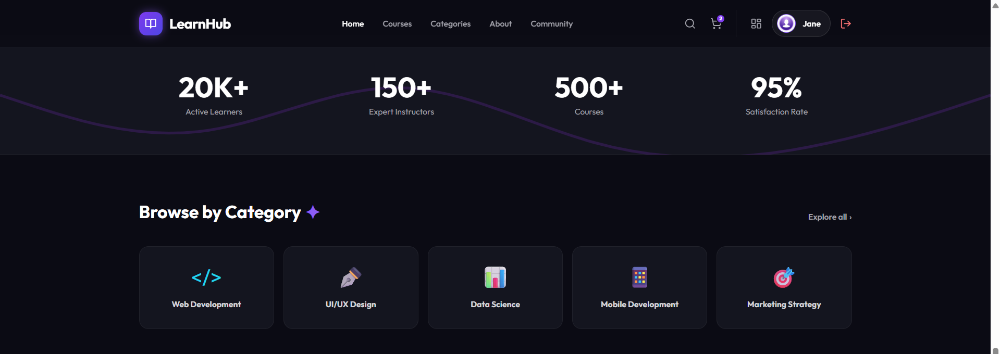

# LearnHub - Premium E-Learning Platform

LearnHub (formerly Sessionly) is a modern, high-end marketplace for creators to host interactive sessions and attendees to book them. Built with a decoupled architecture featuring a React frontend and a Django backend, it features a stunning dark-themed aesthetic, fluid animations, and real-time payment integration.

## 🌟 Highlights & Features
- **Premium Dark Mode UI**: Deep navy background with neon violet accents and glass-morphism effects.
- **Dynamic Animations**: Smooth transitions and interactive elements powered by Framer Motion.
- **Secure Payments**: Fully integrated Razorpay checkout flow for seamless course enrollment.
- **Dashboard & Progression**: Dedicated user dashboard with XP tracking, leveled progression, and real-time enrolled course statuses.
- **Immersive Content**: Beautifully structured course overview pages with video placeholders, tabbed curriculum navigation, and sticky booking widgets.

## 📸 Screenshots

Here is a glimpse of the LearnHub platform:

### 1. Home Page & Hero Section


### 2. Login & Authentication


### 3. Popular Courses Marketplace


### 4. Interactive Categories & Testimonials


---

## 🏗 Architecture Overview

The platform uses a microservices-inspired decoupled architecture:

1. **Frontend (React & Vite)**:
   - State management via Zustand
   - Styling via Tailwind CSS
   - Interactive UI via Framer Motion
2. **Backend (Django REST Framework)**:
   - Serves the robust RESTful API
   - Token-based authentication using JWT (JSON Web Tokens)
   - Integration with Google/GitHub OAuth and Razorpay Payments
3. **Database (SQLite/PostgreSQL)**:
   - Relational database containing users, sessions, and bookings

---

## 🚀 Step-by-Step Installation

Follow these steps to run the complete stack locally:

### 1. Clone the Repository
```bash
git clone https://github.com/ayush200545/Learn-Hub.git
cd Learn-Hub
```

### 2. Configure Environment Variables
Create a `.env` file in the `backend/` directory with the following structure:
```env
DJANGO_SECRET_KEY=your-secret-key
DJANGO_DEBUG=True
DJANGO_ALLOWED_HOSTS=localhost,127.0.0.1
USE_SQLITE=True
CORS_ALLOWED_ORIGINS=http://localhost:5173,http://localhost:5174
FRONTEND_URL=http://localhost:5174
RAZORPAY_KEY_ID=rzp_test_xxxxxx
RAZORPAY_KEY_SECRET=xxxxxxxxxxxx
```

### 3. Setup Backend
```bash
cd backend
python -m venv venv
venv\Scripts\activate
pip install -r requirements.txt
python manage.py migrate
python manage.py seed_data  # Populates DB with 26 diverse courses
python manage.py runserver 8000
```

### 4. Setup Frontend
```bash
cd frontend
npm install
npm run dev
```

### 5. Access the Application
- **Frontend / Main Site:** `http://localhost:5173/` or `http://localhost:5174/`
- **Backend API:** `http://localhost:8000/api/`
- **Django Admin:** `http://localhost:8000/admin/`

---

## 🎮 Demo Flow

Experience the full capabilities of LearnHub by following this demo workflow:

1. **Log in with Demo Account:**
   - Go to the frontend and click **Sign In**.
   - Use the pre-seeded account: `attendee@demo.com` / `demo1234`.
2. **Find and Book a Session:**
   - Browse the homepage or use the search bar to find an interesting course.
   - Click on the session card to view its immersive details page.
   - Click **Enroll Now** and proceed to **Complete Purchase**.
3. **Checkout with Razorpay:**
   - Follow the Razorpay mock payment flow.
   - Upon successful payment, you will be redirected to the User Dashboard.
4. **User Dashboard:**
   - View your enrolled courses, check your XP progress, and track your level!

---

*Enjoy building and hosting sessions with LearnHub!*
